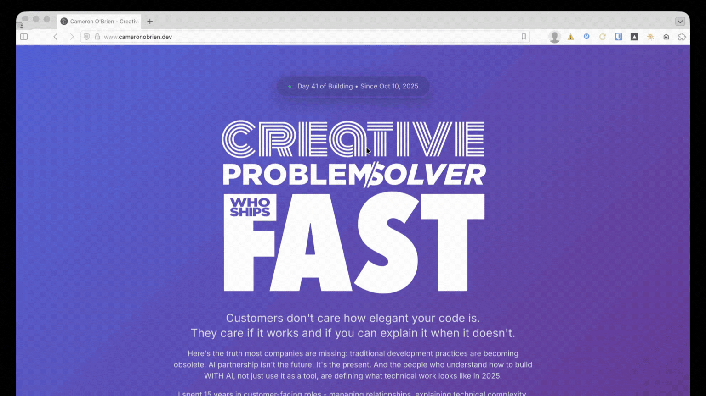

# GIF Recorder

Chrome extension that records tab content and converts to GIF using server-side processing.



## Features

- Record any browser tab with one click
- Server-side WebM to GIF conversion (ffmpeg with palette optimization)
- Animated icon shows recording state (green = ready, red pulse = recording)
- Auto-download with smart filenames: `site-name_Nov20-2025-230pm.gif`
- Queue system for multiple recordings
- Configurable FPS, resolution, and quality

## Components

### `/extension` - Chrome Extension
- Records tab content using `chrome.tabCapture`
- Uploads WebM to server for conversion
- Auto-downloads completed GIFs

### `/server` - Conversion API
- Express server with ffmpeg
- Converts WebM to GIF with palette optimization
- Background job processing
- Auto-cleanup after 1 hour

## Quick Start

### 1. Deploy Server

```bash
# Copy to your server
scp -r server/* root@YOUR_IP:/var/www/gif-converter-api/

# SSH and install
ssh root@YOUR_IP
cd /var/www/gif-converter-api
apt install ffmpeg  # if not installed
npm install
pm2 start ecosystem.config.cjs
pm2 save
```

### 2. Configure Extension

```bash
cd extension
cp config.example.js config.js
```

Edit `config.js` with your server URL:
```javascript
const CONFIG = {
  API_URL: 'http://YOUR_IP:3005'
};
```

### 3. Load Extension

1. Open Chrome/Vivaldi: `chrome://extensions/`
2. Enable "Developer mode"
3. Click "Load unpacked"
4. Select the `extension/` folder

## Usage

1. **Click extension icon** - Opens settings tab
2. **Navigate to any webpage** - Icon turns green (ready to record)
3. **Click green icon** - Starts recording, icon pulses red
4. **Click red icon** - Stops recording, returns to settings tab
5. **GIF auto-downloads** when conversion completes

## Settings

- **FPS**: 5/10/15 fps (default: 10)
- **Width**: 480p/720p/1080p (default: 720p)
- **Quality**: Low/Medium/High (default: Medium)

Defaults are optimized for GitHub READMEs. Settings persist between recordings.

## Architecture

```
Click Icon → Record Tab → WebM Upload → Server (ffmpeg) → GIF Download
```

## Server Requirements

- Node.js 18+
- ffmpeg installed
- PM2 for process management

## Server Endpoints

- `POST /convert` - Upload WebM for conversion
- `GET /status/:jobId` - Check job progress
- `GET /download/:jobId` - Download completed GIF
- `GET /health` - Server health check

## License

MIT
