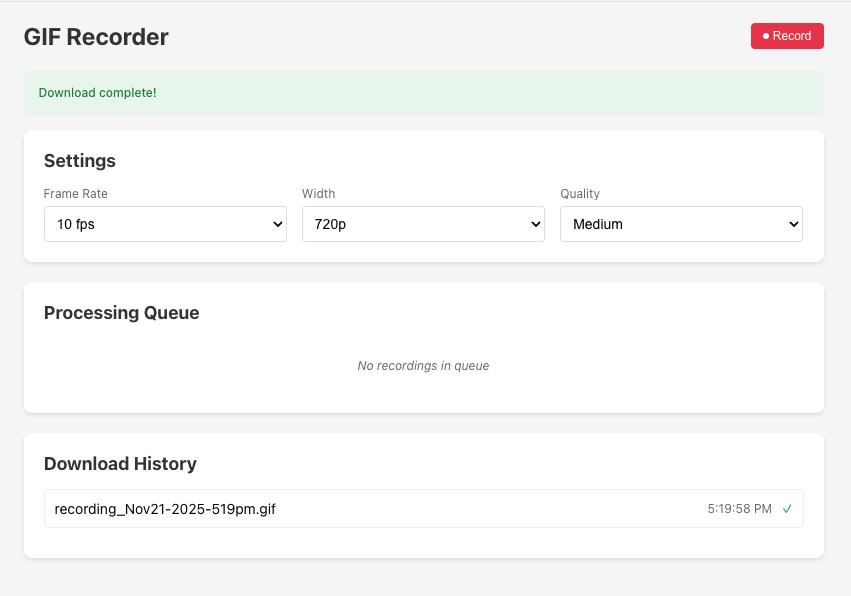

# GIF Recorder

Chrome extension with native macOS app that records browser windows and converts to GIF using server-side processing.



## Features

- **Native macOS screen capture** using ScreenCaptureKit for perfect cursor positioning
- Record browser window content with one click (green icon = ready)
- Server-side MP4 to GIF conversion (ffmpeg with palette optimization)
- Animated icon shows recording state (green = ready, red pulse = recording)
- Auto-download with smart filenames: `recording_Nov22-2025-230pm.gif`
- Queue system with real-time progress tracking
- Configurable FPS, resolution, and quality
- Settings persist between sessions

## Architecture

```
Click Record → Native App (ScreenCaptureKit) → MP4 → Upload → Server (ffmpeg) → GIF Download
```

The extension uses Chrome's Native Messaging to communicate with a Swift app that handles screen capture using macOS ScreenCaptureKit. This solves the cursor position bug on Retina displays that affects browser-based capture APIs.

## Components

### `/extension` - Chrome Extension
- UI for settings and recording controls
- Native Messaging communication with macOS app
- Auto-downloads completed GIFs

### `/native-app` - macOS Swift App
- ScreenCaptureKit for window capture
- AVAssetWriter for H.264 encoding
- Uploads MP4 to server for conversion

### `/server` - Conversion API (Digital Ocean)
- Express server with ffmpeg
- Converts MP4 to GIF with palette optimization
- Background job processing with progress tracking
- Auto-cleanup after 1 hour

## Installation

### 1. Build Native App

```bash
cd native-app
swift build -c release

# Create app bundle
mkdir -p ~/Apps/GifRecorder.app/Contents/MacOS
cp .build/release/GifRecorder ~/Apps/GifRecorder.app/Contents/MacOS/
```

Create `~/Apps/GifRecorder.app/Contents/Info.plist`:
```xml
<?xml version="1.0" encoding="UTF-8"?>
<!DOCTYPE plist PUBLIC "-//Apple//DTD PLIST 1.0//EN" "http://www.apple.com/DTDs/PropertyList-1.0.dtd">
<plist version="1.0">
<dict>
    <key>CFBundleIdentifier</key>
    <string>com.cameron.gifrecorder</string>
    <key>CFBundleName</key>
    <string>GifRecorder</string>
    <key>CFBundleExecutable</key>
    <string>GifRecorder</string>
    <key>LSUIElement</key>
    <true/>
    <key>NSScreenCaptureUsageDescription</key>
    <string>GIF Recorder needs screen access to record your screen.</string>
    <key>NSAppTransportSecurity</key>
    <dict>
        <key>NSAllowsArbitraryLoads</key>
        <true/>
    </dict>
</dict>
</plist>
```

### 2. Install Native Messaging Manifest

Create `~/Library/Application Support/Google/Chrome/NativeMessagingHosts/com.cameron.gifrecorder.json`:
```json
{
  "name": "com.cameron.gifrecorder",
  "description": "GIF Screen Recorder Native Helper",
  "path": "/Users/YOUR_USERNAME/Apps/GifRecorder.app/Contents/MacOS/GifRecorder",
  "type": "stdio",
  "allowed_origins": [
    "chrome-extension://YOUR_EXTENSION_ID/"
  ]
}
```

### 3. Grant Screen Recording Permission

**System Settings → Privacy & Security → Screen Recording** → Add `GifRecorder.app`

### 4. Deploy Server

```bash
scp -r server/* root@YOUR_IP:/var/www/gif-converter-api/

ssh root@YOUR_IP
cd /var/www/gif-converter-api
apt install ffmpeg
npm install
pm2 start ecosystem.config.cjs
pm2 save
```

### 5. Configure Extension

```bash
cd extension
cp config.example.js config.js
```

Edit `config.js`:
```javascript
const CONFIG = {
  API_URL: 'http://YOUR_IP:3005'
};
```

### 6. Load Extension

1. Open Chrome/Vivaldi: `chrome://extensions/`
2. Enable "Developer mode"
3. Click "Load unpacked" → select `extension/` folder
4. Copy the Extension ID
5. Update the native messaging manifest with the Extension ID

## Usage

1. **Click extension icon** - Opens settings tab (icon turns green when ready)
2. **Click green icon** - Starts recording the browser window immediately
3. **Click red pulsing icon** - Stops recording, returns to settings
4. **GIF auto-downloads** when conversion completes

## Settings

- **FPS**: 5/10/15/30 fps (default: 10)
- **Width**: 480p/720p/1080p (default: 720p)
- **Quality**: Low/Medium/High (default: Medium)

## Technical Challenges & Solutions

### Cursor Position Offset on macOS Retina

**Problem**: Browser capture APIs (`tabCapture`, `getDisplayMedia`) have cursor positioning bugs on Retina displays.

**Solution**: Native macOS app using ScreenCaptureKit handles cursor coordinate transformations correctly.

### Window-Only Capture

**Problem**: Need to capture only the browser window, not the entire screen.

**Solution**: Use `SCContentFilter` with display capture and `excludingWindows` to show only the target window, then crop to window bounds using `sourceRect`.

### Pixel Buffer to Video Encoding

**Problem**: ScreenCaptureKit outputs CVPixelBuffers, but AVAssetWriterInput expects encoded video data.

**Solution**: Use `AVAssetWriterInputPixelBufferAdaptor` to properly convert pixel buffers to H.264 encoded video.

### Browser Detection

**Problem**: Need to find the correct browser window to record.

**Solution**: Support multiple Chromium browsers (Chrome, Vivaldi, Arc, Brave, Edge) by checking bundle identifiers and selecting the largest window.

## Supported Browsers

- Google Chrome
- Vivaldi
- Arc
- Brave
- Microsoft Edge
- Chromium

## Server Requirements

- Node.js 18+
- ffmpeg installed
- PM2 for process management

## Server Endpoints

- `POST /convert` - Upload MP4 for conversion
- `GET /status/:jobId` - Check job progress
- `GET /download/:jobId` - Download completed GIF
- `DELETE /cleanup/:jobId` - Manual cleanup

## License

MIT
